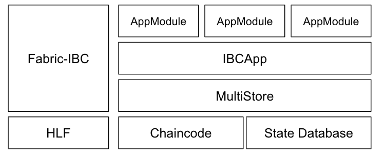
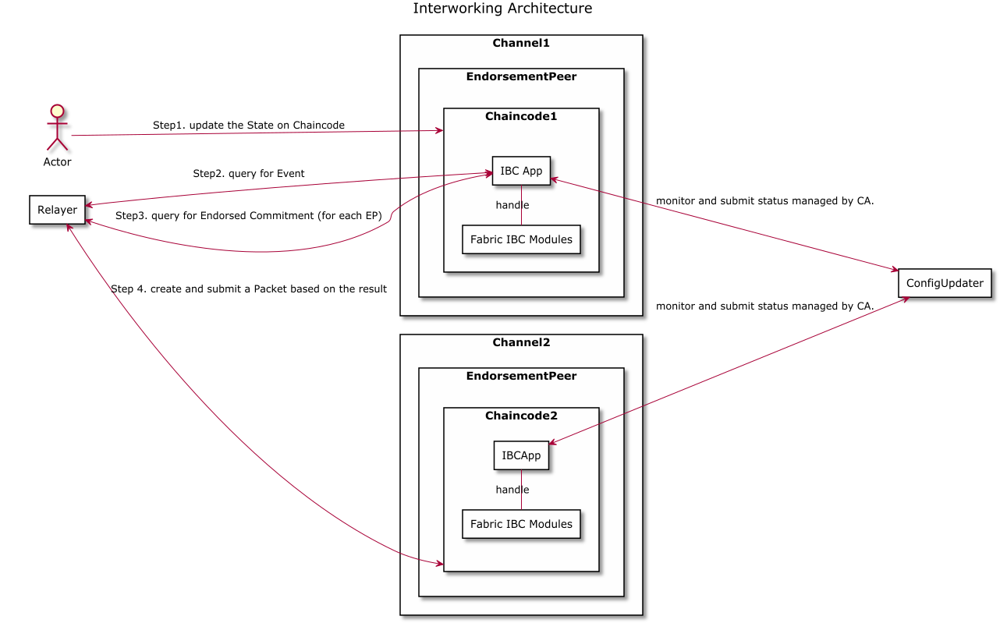
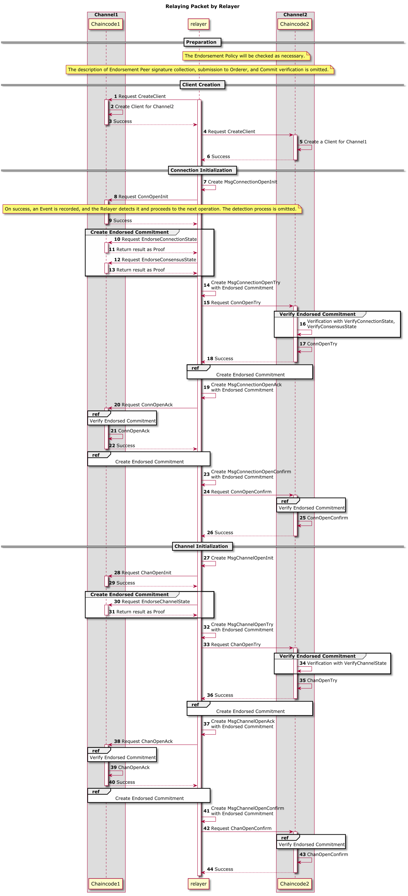
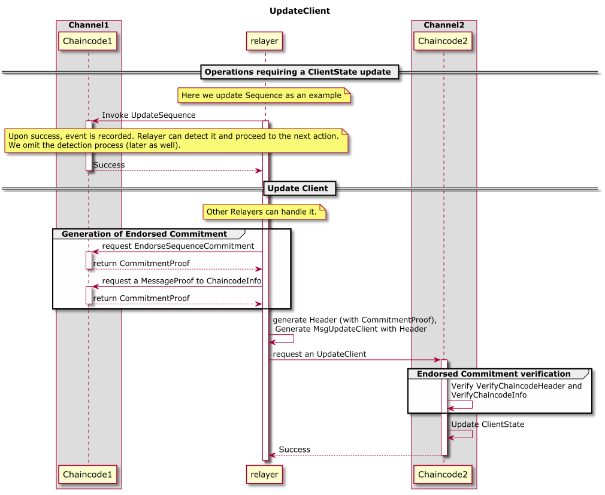

# Architecture

Fabric-IBC provides its own App (IBCApp), which can use Cosmos SDK modules in the same way as regular Cosmos applications. Developers can implement business logic as modules, which will be executed as chaincodes via MultiStore and App provided by Fabric-IBC.

When a Tx is submitted, the stub and Tx are passed to the IBCApp, which executes the Tx and writes the result to MultiStore.
In order to allow IBCApps to access the Hyperledger Fabric State Database, Fabric-IBC provides a MultiStore that uses the stub API.
The IBCApp also provides query methods for querying via Cosmos SDK's query services.

## Flow diagram between components upon user operations

This diagram shows the flow between components when a user requests an update operation to a Chaincode running on an Application Channel on a Fabric network, where the result is propagated to another Fabric network.

### IBC App

The IBC App manages the IBC module, handling input, routing to the appropriate module, executing, and managing the state.
The Chaincode instance provides IBC functionality through this App.

### Fabric IBC Modules

This is a set of chaincodes that provide the means for Fabric client to generate Proof and headers needed for state validation.
See [Fabric IBC Modules](03_ibc.md#fabric-ibc-modules) for details.

### ConfigUpdater

When there is a change in the state of the Fabric CA, this module provides a transaction to reflect the latest state in the ClientState by UpdateClient.

### Relayer Sequence Diagram

## Connection, Channel establishment

As shown in [Connection, Channel](03_ibc.md#connection-channel), the state transition model of Connection and Channel in Fabric-IBC follows IBC. At the same time, each flow needs the means for verification using Endorsed Commitment.

The following sequence diagram shows the flow until the IBC Connection and Channel are opened between two Fabric Application Channels.

For more information about Endorsed Commitment, please refer to [Endorsed Commitment](03_ibc.md#endorsed-commitment).

For verification functions starting with Verify, refer to [State Verification Function](05_fabric-client-spec.md#state-verification-functions).

## Client update flow

The following sequence diagram shows the flow of the Client update process after the IBC Connection and Channel are established between two Fabric Application Channels.
Here, we show the example of the update of Sequence, which is processed based on the state update maintained in [Client](03_ibc.md#client).
This process is also required for IBC Policy updates.

## Creation and verification of Endorsed Commitment

In Fabric-IBC, [Endorsed Commitment](03_ibc.md#endorsed-commitment) is used as a Proof of Commitment that a key/value pair exists in the State of a Chaincode on a Fabric Application Channel.

As an example, when there are two different Fabric Application Channels, the following sequence diagram for PacketCommitment shows the flow of verification of the State on Channel2 after requesting Commitment Proof for a State on Channel1.

Note: The process in the grayed area (Chaincode) in the above diagram is a process that occurs on a single Peer and does not involve network communication between internal components.

The Relayer will then relay the PacketAcknowledgement from Channel2 to Channel1 in the same way.

### HandleTx

This is defined as a method in Chaincode, which receives Msg and passes it to the initialized IBC App instance. After that, if the result of the IBC App processing is valid, the Event contained will be sent in response via the Fabric's [Event API](https://hyperledger-fabric.readthedocs.io/en/release-2.2/developapps/transactioncontext.html#stub).

### Msg

An object defined in each Module for updating the State.
It is routed by the IBC App.
