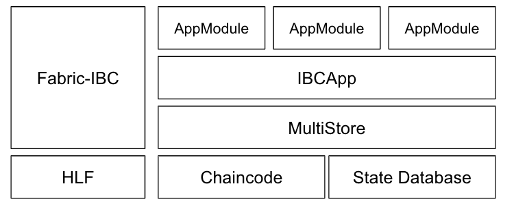
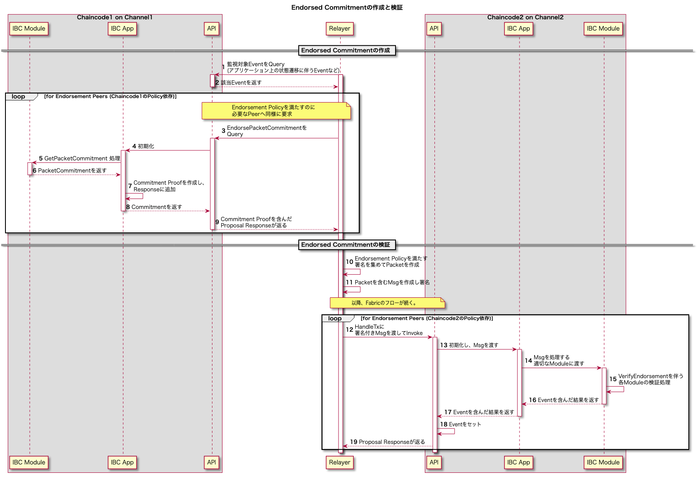

# Architecture

Fabric-IBCは独自のApp(IBCApp)を提供し、通常のCosmos SDKアプリケーションと同様に、Cosmos SDKのmoduleを利用することができる。開発者はビジネスロジックなどをmoduleとして実装でき、それらはFabric-IBCが提供するApp、MultiStoreを介してChaincodeとして実行される。

Txが提出されると、IBCAppにstubとTxが渡される。IBCAppはTxを実行し結果をMultiStoreに書き込む。
IBCAppがHyperledger FabricのState Databaseに対して操作を行えるように、Fabric-IBCはstub APIを用いるMultiStoreを提供する。
また、IBCAppはCosmos SDKのquery services経由でクエリするためのクエリメソッドを提供する。

## ユーザ操作からの関連コンポーネント間フロー図

あるFabricネットワーク上のApplication Channel上で動作するChaincodeに対して、ユーザが更新処理を要求した際、その結果が別のFabricネットワーク上へ伝播する際のコンポーネント間のフローを整理する。

### IBC App

IBC moduleを管理し、入力をHandleし適切なmoduleにrouting及び実行し、状態を管理する。
Chaincode instanceはこのAppを通してIBCの機能を提供する。

### Fabric IBC Modules

Fabric clientが状態検証に必要とするProofやHeaderを生成する機能を提供するchaincode群。
詳細については[Fabric IBC Modules](03_ibc.md#fabric-ibc-modules)を参照。

### ConfigUpdater

Fabric CAの状態に変更があった場合、最新の状態をUpdateClientによりClientStateに反映するためのTransactionを提出する。

# Relayer シーケンス図

## Connection、Channel確立

[Connection, Channel](03_ibc.md#connection-channel)にもあるように、Fabric-IBCでのConnection、Channelの状態遷移モデルはIBCに従う。一方、それぞれのフローではEndorsed Commitmentを用いた検証が必要となる。

2つのFabric Application Channel間でIBCのConnectionとChannelが開かれるまでのフローを以下のシーケンス図で示す。

上記のシーケンス図中に登場する内容について、Endorsed Commitmentについては、[Endorsed Commitment](03_ibc.md#endorsed-commitment)を参照。

Verifyから始まる検証系の関数については、[State Verification Function](05_fabric-client-spec.md#state-verification-functions)を参照。

## Client更新のフロー

2つのFabric Application Channel間で、IBCのConnectionおよびChannelが確立した後での、Client更新処理のフローをシーケンス図で示す。
ここではSequenceの更新を例に挙げるが、[Client](03_ibc.md#client)が保持する状態の更新に伴って行われる処理である。IBC Policyの更新などでも必要となる。

## Endorsed Commitment の作成と検証

Fabric-IBCではあるFabric Application Channel上のChaincodeのStateにキー/値ペアが存在しているというCommitmentへのProofとして、[Endorsed Commitment](03_ibc.md#endorsed-commitment)を用いる。

例として、2つの異なるFabirc Application Channelがあるとき、一方(Channel1とする)上のStateに対してCommitment Proofを要求した後、他方(Channel2とする)でそのStateの検証を行う流れを、PacketCommitmentに関するシーケンス図で示す。

注意: 上図の灰色で覆われた領域(Chaincode)内の処理は1つのPeer上で起こる処理であり、内部のコンポーネント間ではネットワーク通信を伴わない。

Relayerはこの後、Channel2からChannel1に対して同様の手順でPacketAcknowledgementをrelayすることになる。

### HandleTx

Chaincode内のメソッドとして定義される。Msgを受け取り、初期化したIBC Appインスタンスに渡す。その後IBC Appの処理結果が正常であればそこに含まれるEventをFabricの[Event API](https://hyperledger-fabric.readthedocs.io/en/release-2.2/developapps/transactioncontext.html#stub)経由でResponseに含める。

### Msg

Stateの更新を目的として、各Moduleで定義されるオブジェクト。
IBC Appによってroutingされる。
